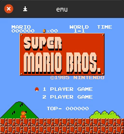

# NEMU
A simple NES(Nintendo Entertainment System) emulator( ˘ω˘)



## sample


## required
- gcc
- allegro5 library

## build
### on Linux
```sh
$ make
$ ./emu <.nes file>
```
### on Windows
🙇

## license
MIT License
